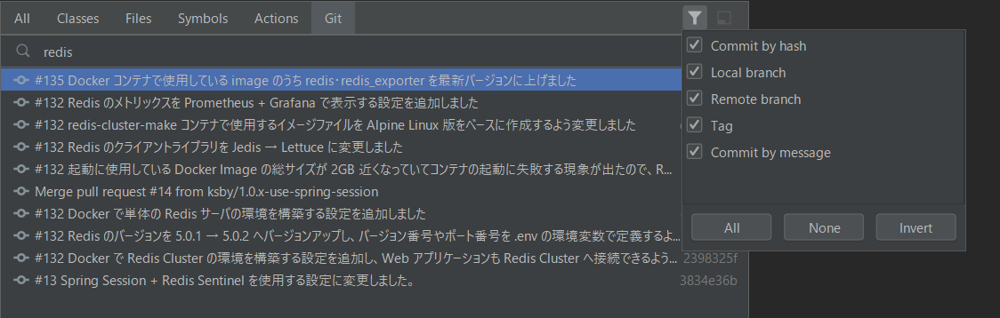

[[idea-20203-whatsnew]]
= IntelliJ IDEA 2020.3 新機能メモ書き

[[idea-20203-whatsnew-overview]]
== 概要

IntelliJ IDEA 2020.3 にバージョンアップしたので新機能を確認した時のメモ書きです。

[[idea-20203-whatsnew-reference]]
== 参照したサイト・書籍

* What’s New in IntelliJ IDEA 2020.3 +
https://www.jetbrains.com/idea/whatsnew/#whats-new-20203

[[idea-20203-whatsnew-item]]
== 手順

[[idea-20203-whatsnew-item-search-everywhere-updates]]
=== Search Everywhere updates

Search Everywhere dialog で `commit hashes and messages, tags, and branches` が検索できるようになりました。

Shift キーを２回押してダイアログを表示した後、「Git」タブを選択してから `redis`（commit message にこの文字列が入力されているものがあります）と入力してみましたが、何も表示されず。。。

ダイアログ右上の「Filter」ボタンをクリックすると「Commit by hash」しかチェックされていませんでした。

「All」ボタンをクリックして全てチェックすると commit message も検索してヒットしたものが表示されるようになりました。

